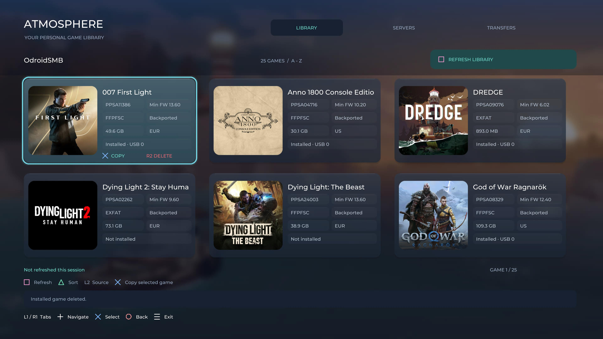
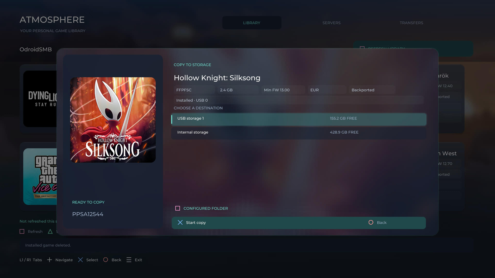

# Atmosphere

See [CHANGELOG.md](CHANGELOG.md) for changes and update requirements.

Atmosphere is a controller-driven PS5 homebrew application for browsing games on your own SMB, FTP, and WebDAV HTTP/HTTPS servers and copying them to internal storage or an attached USB drive. It is derived from [Orbit Store](https://github.com/saawant12/orbit-store-ps5).

The current application uses a native OpenGL interface and an in-process C backend. Normal browsing and copying do not require a separately launched service ELF.

[Watch the Atmosphere demo (WebM)](https://github.com/flex36ty/ps5-atmosphere-installer/releases/download/v2026.10.07.2/Atmosphere_20261008000625.webm)





## Features

- Multiple simultaneously active SMB, FTP, and WebDAV servers in one library, including anonymous/guest connections; activate, deactivate, edit, duplicate, and remove saved servers.
- Automatic scan of active servers on startup, retaining the cached library while refreshing. Native app use does not require pairing.
- Discovery of game folders, exFAT images, and FFPFSC images, with metadata and cached cover art where supported.
- Smooth scrolling, animated card lift, square cover cards, and a frosted background. Overflowing text scrolls left with two-second pauses at the end and after resetting.
- Solid format badges on posters, a dedicated server row, and compact Installed status on cards; the copy popup retains the installed location.
- Sorting by title or date added.
- Choose a destination folder in the copy popup with Square. Options follow readable ShadowMountPlus `scanpath` settings, or its defaults (`homebrew`, `etaHEN/games`, and external-drive root). The full path is shown and the last copy destination is remembered per drive. Saved custom server destinations remain available for compatibility; new server settings no longer ask for a local folder.
- Automatic repair of permission-denied errors on the default internal destination and staging folders, using a bundled etaHEN helper.
- Transfer progress, speed, pause/resume, and SHA-256 verification.
- Installed-game detection by metadata title ID, with installed-source deletion through ShadowMountPlus.
- Minimum firmware display when present in metadata. Backported indicates detected `fakelib`/`fakelib2` content; Not Backported means no marker was detected. Neither label guarantees compatibility or proves that files are unmodified.
- Subdued metadata tags and short region labels derived from a valid game content ID. Region is a content territory, not a guarantee of language support or region locking. Rescan after updating to populate the new field; unavailable regions show Unknown.
- ShadowMountPlus rescan requests after transfers. Detection may complete after Atmosphere closes.

## Requirements and status

The current deployment is a folder application named **Atmosphere**, title ID **PPSA99005**, used with an existing etaHEN/kstuff and ShadowMountPlus setup. Development and console testing have used firmware **12.70**; compatibility with every firmware through 13.60 has not been verified.

The working folder deployment should not be confused with the older experimental PKG build. A generally installable PKG is not currently validated.

The delete workflow uses a bundled helper launched through etaHEN's local ELF loader on port 9021. Atmosphere closes before that helper deletes the confirmed installed source. Leave the app closed while deletion finishes.

Internal permission repair also requires etaHEN's ELF loader on port 9021. If `/data/homebrew` or `/data/.atmosphere-smb-staging` rejects access, the app launches `atmosphere_permissions.elf`, waits for confirmation, and retries. The helper grants read/write/traverse permissions on that directory only; it does not recursively change game files or repair custom destinations. Copy the helper alongside `eboot.bin` when updating to a build with this feature.

## Installation

These instructions describe the tested **USB folder installation with ShadowMountPlus**. Download `Atmosphere-PPSA99005-2026.10.08.1.zip` from the [GitHub release](https://github.com/flex36ty/ps5-atmosphere-installer/releases/tag/v2026.10.08.1). This attachment contains the complete install folder, including runtime modules. The automatically generated source ZIP is not a ready-to-run application.

The v2026.10.08.1 release adds WebDAV, startup scanning, removal of the native pairing notification, and a password-keyboard fix. Close Atmosphere before updating and preserve `atmosphere-state`. Replace the complete build: its updated graphics interface needs the matching executable and modules. Build and regression checks passed; the latest modules have been uploaded and verified, while end-to-end WebDAV copying and the password-keyboard fix still await user confirmation on the console. See the changelog for details. The demo and screenshots above show an earlier layout.

1. Start your working etaHEN/kstuff session and ensure ShadowMountPlus is available.
2. Extract the complete Atmosphere folder build on your computer. Keep its supplied directory structure and runtime files intact.
3. Copy the entire `PPSA99005` folder into the USB drive's `homebrew` directory or /data/homebrew directory. The tested console path is `/mnt/usb0/homebrew/PPSA99005`. You can copy it with the drive connected to your computer or use the PS5's FTP server. The USB mount number may differ on your console.
4. Check that `eboot.bin` is directly inside `PPSA99005`, rather than accidentally nested inside another `PPSA99005` directory. The layout should include:

   ```text
   homebrew/
     PPSA99005/
       eboot.bin
       atmosphere_delete.elf
       atmosphere_permissions.elf
       sce_sys/
         param.json
         icon0.png
       sce_module/
         atmosphere_backend.prx
         atmosphere_ui.prx
         ...other supplied runtime modules
       ui/
         ...supplied UI assets
   ```

5. Let ShadowMountPlus scan/register the folder using your existing setup. Close any running application if detection is pending.
6. Launch **Atmosphere** from the PS5 home screen, then configure a server as described below.

### First server setup

Open **Servers** and press **Square** to add a server. Choose SMB, FTP, or WebDAV and enter the server IP address or hostname.

- **SMB:** enter the share name separately from the folder. For example, `\\SERVER\games\ps5` uses share `games` and folder `ps5`. The default port is `445`. Guest shares can use blank credentials if the server permits guest access.
- **FTP:** enter the folder relative to the FTP server's root, without a leading slash. Leave Share and Domain blank. The default port is `21`; blank username/password uses anonymous FTP if the server permits it. This is plain FTP, not SFTP.
- **WebDAV:** choose `webdav` for HTTP or `webdavs` for HTTPS. Enter only the hostname/IP in Server, set Port (`80`/`443` by default), and enter the URL path without a leading slash in Folder. For `http://SERVER:5008/ps5/`, use Server `SERVER`, Port `5008`, Folder `ps5`. Leave Share and Domain blank. Basic username/password authentication and anonymous access are supported. HTTPS verifies certificates against the bundled CA store; self-signed certificates are not automatically trusted. The server must support Depth-1 PROPFIND listings, HEAD, and HTTP byte ranges. Redirects are rejected; configure the final endpoint directly.

Startup scanning, WebDAV, removal of the native pairing notification, and the password-keyboard fix are included in v2026.10.08.1. They are not present in the older v2026.10.08 ZIP.

Save the server, highlight it, and press **Cross** so its status reads **ACTIVE**. Go to **Library** and press **Square** to scan. If the list stays empty, check the server path, permissions, and that the PS5 can reach the server on your network.

You can leave several servers active. Library refresh scans them sequentially and combines their games; each card identifies its server. Deactivating one server hides its games without deactivating the others. Highlight a server and press **Triangle** to edit that entry, or **L2** to duplicate it after confirmation. Duplicates start inactive so you can edit them before activation. Copies and scans still use a single worker; this does not enable concurrent transfers.

## Usage

1. Launch Atmosphere from the registered folder application.
2. Open **Servers**, add an SMB, FTP, or WebDAV server, and activate it. Use your server address, share/path, and credentials as appropriate.
3. Return to **Library** and press Square to scan.
4. Select a game, choose a destination, and start copying.
5. Close Atmosphere with Options when finished so ShadowMountPlus can finish detecting copied games.

Game files and configured server credentials are not included in this repository.

## Controller controls

| Control | Action |
| --- | --- |
| D-pad / left stick | Move selection |
| L1 / R1 | Switch tabs |
| Cross | Select / confirm; activate or deactivate a highlighted server |
| Circle | Back / dismiss |
| Square in Library | Refresh / scan |
| Triangle in Library | Change sort |
| R2 on an installed game | Open delete confirmation |
| Square in Servers | Add server |
| L2 in Library | Open Servers |
| Triangle in Servers | Edit highlighted server, active or inactive |
| L2 in Servers | Duplicate highlighted server with confirmation |
| R2 in Servers | Remove selected server |
| Options | Close Atmosphere |

Follow the on-screen hints for transfer and destination controls.

## License and credits

GPL-3.0-or-later. See [LICENSE](LICENSE), [THIRD-PARTY-NOTICES.md](THIRD-PARTY-NOTICES.md), and [native OpenGL notices](native-launcher/OPENGL-NOTICES.txt).

Original upstream: Orbit Store by saawant12. Original attribution and upstream URLs are retained. Game names and artwork belong to their respective owners and are not covered by the application's source license.
