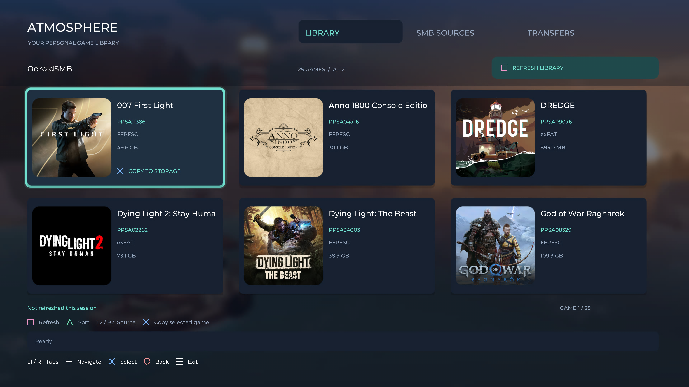

# Atmosphere

Atmosphere is a controller-driven PS5 homebrew application for browsing games on your own SMB and FTP servers and copying them to internal storage or an attached USB drive. It is derived from [Orbit Store](https://github.com/saawant12/orbit-store-ps5).

The current application uses a native OpenGL interface and an in-process C backend. Normal browsing and copying do not require a separately launched service ELF.



*Library screenshot from an earlier build; current labels and controls may differ.*

## Features

- Multiple SMB and FTP servers, including anonymous/guest connections; activate, deactivate, edit, and remove saved servers.
- Discovery of game folders, exFAT images, and FFPFSC images, with metadata and cached cover art where supported.
- Smooth scrolling, controller focus animations, square cover cards, and a frosted background.
- Sorting by title or date added.
- Copy to internal storage or USB, including a USB-root destination option.
- Transfer progress, speed, pause/resume, and SHA-256 verification.
- Installed-game detection by metadata title ID, with installed-source deletion through ShadowMountPlus.
- Minimum firmware display when present in metadata. The Backported label indicates detected `fakelib`/`fakelib2` content; it does not guarantee compatibility.
- ShadowMountPlus rescan requests after transfers. Detection may complete after Atmosphere closes.

## Requirements and status

The current deployment is a folder application named **Atmosphere**, title ID **PPSA99005**, used with an existing etaHEN/kstuff and ShadowMountPlus setup. Development and console testing have used firmware **12.70**; compatibility with every firmware through 13.60 has not been verified.

The working folder deployment should not be confused with the older experimental PKG build. A generally installable PKG is not currently validated.

The delete workflow uses a bundled helper launched through etaHEN's local ELF loader on port 9021. Atmosphere closes before that helper deletes the confirmed installed source. Leave the app closed while deletion finishes.

## Usage

1. Launch Atmosphere from the registered folder application.
2. Open **Servers**, add an SMB or FTP server, and activate it. Use your server address, share/path, and credentials as appropriate.
3. Return to **Library** and press Square to scan.
4. Select a game, choose a destination, and start copying.
5. Close Atmosphere with Options when finished so ShadowMountPlus can finish detecting copied games.

Game files and configured server credentials are not included in this repository.

## Controller controls

| Control | Action |
| --- | --- |
| D-pad / left stick | Move selection |
| L1 / R1 | Switch tabs |
| Cross | Select / confirm; activate or deactivate a highlighted server |
| Circle | Back / dismiss |
| Square in Library | Refresh / scan |
| Triangle in Library | Change sort |
| R2 on an installed game | Open delete confirmation |
| Square in Servers | Add server |
| Triangle in Servers | Edit active server |
| R2 in Servers | Remove selected server |
| Options | Close Atmosphere |

Follow the on-screen hints for transfer and destination controls.

## Source layout

| Directory | Contents |
| --- | --- |
| `backend/` | Discovery, SMB/FTP adapters, transfers, storage, metadata, and installed-game integration |
| `native-launcher/` | Native controller UI, OpenGL rendering, module bridge, and deletion helper |
| `src/` | React interface used by the desktop/web development variant |
| `tests/` | Backend and transfer regression tests |
| `tools/` | Asset embedding, dependency, and build utilities |
| `launcher/` | Legacy payload launcher support |

## Building

The native build currently depends on the development workspace's SharpProspero toolchain, .NET 10 NativeAOT, PS5 payload SDK, native dependencies, and locally supplied runtime modules. Some scripts contain workspace-specific paths. A clean clone is not yet a one-command native build.

The current module build sequence, from the source directory, is:

```sh
# Linux / WSL, after configuring dependencies and paths
bash native-launcher/compile-backend.sh
bash native-launcher/preview-gl.sh
bash native-launcher/native-ui/compile.sh
```

```powershell
# Windows, with the configured SharpProspero tools
./native-launcher/build-backend.ps1
./native-launcher/native-ui/link.ps1
```

This produces `native-launcher/obj/backend/atmosphere_backend.prx`, `native-launcher/native-ui/obj/atmosphere_ui.prx`, and `native-launcher/obj/atmosphere_delete.elf`. These update an existing compatible folder deployment; they are not a complete standalone package by themselves.

For the web interface, install Node dependencies with `npm ci`, run `npm run typecheck`, and build with `npx vite build`. `python3 tools/embed.py` generates embedded web assets after the required bootstrap inputs are present. [BUILDING.md](BUILDING.md) describes the legacy payload build, not the current native folder packaging workflow.

## Validation

The latest rename build passed TypeScript/Vite compilation, native module builds and signed-file integrity checks, source activation lifecycle tests, and FTP integration tests covering metadata, recursive copies, pause/resume, SHA-256 verification, and migration of older partial-transfer staging directories. Console behavior still needs to be checked after each deployed update.

## License and credits

GPL-3.0-or-later. See [LICENSE](LICENSE), [THIRD-PARTY-NOTICES.md](THIRD-PARTY-NOTICES.md), and [native OpenGL notices](native-launcher/OPENGL-NOTICES.txt).

Original upstream: Orbit Store by saawant12. Original attribution and upstream URLs are retained. Game names and artwork belong to their respective owners and are not covered by the application's source license.
